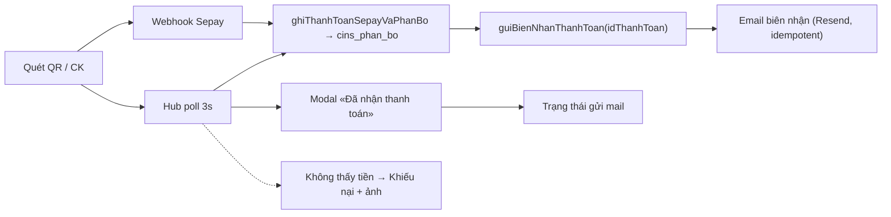

# PLAN — Hub thanh toán: vòng tin cậy + sổ theo dòng dịch vụ

> Trạng thái: **Phase 1–3 đã ship** (biên nhận · khiếu nại ảnh · sổ theo dòng dịch vụ). Nguồn: `PLAN_thanh_toan_tai_cau_truc.md` (P1–P3b đã ship) · `PLAN_sepay_cins.md` · `lib/billing/*` · `components/billing/ThanhToanHubClient.tsx`.
>
> Đầu vào từ user (2026-08-07):
> 1. *«trang thanh toán chỉ thấy hệ thống của CSĐT, không thấy shop»* → thiếu ngữ cảnh theo dòng dịch vụ.
> 2. *«QR + webhook Sepay đang xây ở chat khác, mặc định tự trigger»* → cần **màn cảm ơn + email hoá đơn xác nhận** sau khi tiền vào (tham khảo `sineart-web-v2`).
> 3. *«cần nút khiếu nại nếu đã CK nhưng Sepay không trigger, yêu cầu chụp hình bằng chứng»*.

---

## 1. Chẩn đoán

### 1.1 Shop không thiếu hệ thống — thiếu ngữ cảnh

Backend đã hợp nhất thật: một `cins_tk_thanh_toan`, nhiều `cins_dich_vu`, một `cins_hoa_don`, một STK CINs, một đường Sepay. Phí shop **đang** hiện trên hub. Nhưng UI là bản tổng quát hoá **trang phí CSĐT cũ**:

| Chỗ | Hiện tại | Hệ quả với người chỉ bán hàng |
|---|---|---|
| Lede | Luôn kể cả shop 5% **và** cơ sở 10% + ngưỡng 2tr | Nhồi ngữ cảnh không liên quan |
| KPI 3 | «Dòng dịch vụ: 1» | Không trả lời câu hỏi nào |
| Bảng hoá đơn | Một bảng phẳng trộn mọi loại, 11 cột | Không có “sổ của cửa hàng tôi” |
| Panel «Thanh toán» | Không nói đang trả phí **shop** hay **cơ sở** | Cảm giác cổng CSĐT |
| Khiếu nại | **Chỉ CSĐT** + câu «Shop: sẽ có sau» | Shop hạng hai, không có đường đối soát |
| Ghi chú | «Mã CK kỳ shop là mã tạm (P1)» | Tự tố chưa hoàn thiện → mất tin |
| Nguồn phát sinh phí | Không hiện | Không trả lời *“100.000₫ từ đơn nào?”* |
| Hệ quả khi nợ | Không hiện | Chỉ biết bị khoá nhận đơn sau khi đã bị khoá |

### 1.2 Đứt đoạn tại “thời điểm sự thật”

Hiện tại đã có `poll` (đối soát lại từ `cins_sepay_giao_dich`) và badge *“Đã nhận thanh toán”* nhỏ trong panel. **Thiếu**: không có màn xác nhận đúng nghĩa, **không có email biên nhận**. Người vừa chuyển 100.000₫ không nhận được gì làm bằng.

`lib/billing/send-email-resend.ts` hiện chỉ gửi **thông báo hoá đơn mới** (nợ), chưa có **biên nhận đã thu**.

### 1.3 Khiếu nại: sai bảng, thiếu ảnh, thiếu shop

- `org_phi_khieu_nai` là bảng **CSĐT-specific** (neo `id_to_chuc` + `id_ky`), có **1** ảnh `bien_lai_anh_id`.
- Hub gọi `taoKhieuNaiBilling` nhưng **không truyền `bienLaiAnhId`** → form hub không có upload ảnh.
- Shop **không có** bảng khiếu nại nào.

---

## 2. Tham chiếu `sineart-web-v2` (luồng đã chạy thật)

| File | Vai trò |
|---|---|
| `src/lib/sepay/handle-sepay-webhook.ts` | Khớp mã CK → set «Đã thanh toán» → `void finalize…(…)` gửi email (fire-and-forget) |
| `src/app/api/donghocphi/poll-order/route.ts` | Poll: nếu **vừa** sync sang paid → cũng gọi finalize; trả `receiptEmail` cho client |
| `src/lib/donghocphi/finalize-hp-payment.ts` | Guard `status === paid` → sync dòng chi tiết → gửi biên nhận |
| `src/lib/donghocphi/payment-receipt-email.ts` | Build HTML biên nhận + Resend REST, **`Idempotency-Key: dhp-receipt-<donId>`** |
| `src/app/donghocphi/payment-client.tsx` | `paidSnapshot` → mở `PaySuccessModal`; stepper «Hoàn tất»; `receiptMailUi` (idle/pending/ok/skipped/error) + `receiptSkipUserMessage()` map lý do sang câu người-đọc-được |

**Bốn điều đáng bê nguyên:**

1. Email gửi từ **cả hai** đường: webhook (chính) **và** poll (khi user đang ngồi chờ) — idempotent nên gọi 2 lần vô hại.
2. Idempotency-Key ở tầng Resend → không cần cột `da_gui_email` trong DB.
3. Fire-and-forget: gửi mail **không được** chặn/500 webhook Sepay.
4. UI nói thật về trạng thái mail (đã gửi / bỏ qua vì thiếu email / lỗi), không im lặng.

**Một điều phải làm khác:** sineart là 1 đơn = 1 lần trả. CINs thì **một CK có thể phân bổ nhiều hoá đơn** và có thể **còn dư** (`cins_phan_bo`, `cins_thanh_toan.con_lai_vnd`). → Biên nhận CINs neo **`cins_thanh_toan.id`**, không phải hoá đơn: một email liệt kê các kỳ đã trừ + số dư giữ lại.

---

## 3. Nguyên tắc thiết kế

1. **Một hub, một tài khoản, một đường tiền.** Không tách trang shop, không STK riêng.
2. **Dòng dịch vụ là “sổ”**, không phải nhãn: có nguồn phát sinh · kỳ · công thức · hệ quả khi nợ · đường đối soát.
3. **Gọi theo thứ user hiểu:** «Cửa hàng Basakila», «Cơ sở X»; loại phí là thuộc tính.
4. **Chỉ nói điều liên quan** (lede/KPI adaptive theo `theoDichVu`).
5. **Mỗi đồng phải truy được về dòng phát sinh** (`shop_phi_dong` / `org_phi_dong`).
6. **Tiền vào là một sự kiện, không phải một thay đổi số.** Có xác nhận trên màn + biên nhận trong hộp thư.
7. **Sepay có thể trượt** — luôn có đường người: tự khai + khiếu nại kèm ảnh.
8. Phase 1–2 **không ALTER bảng live**; bảng mới thì được (cần user confirm).

---

## 4. Phase 1 — Vòng tin cậy thanh toán (ưu tiên cao nhất)



### 4.1 Email biên nhận — `lib/billing/bien-nhan.ts` (mới)

```
guiBienNhanThanhToan(idThanhToan) →
  { sent: true } | { sent: false; reason: string; hint?: string }
```

- Đọc `cins_thanh_toan` (số tiền · nhận lúc · nguồn · `con_lai_vnd` · `tai_khoan_nguon` đã mask) + `cins_phan_bo` join `cins_hoa_don` → danh sách kỳ được trừ (dịch vụ · kỳ · số tiền · còn nợ sau trừ).
- Người nhận: tái dùng `resolveEmailNhanHoaDon` (`email_hoa_don` → `email_lien_he` → Auth). Cân nhắc **CC người phụ trách** (kế toán) — cần chốt (§8 Q-A).
- Guard: `id_tk != null` và có ≥1 dòng phân bổ; nếu `matched: false` (CK không khớp mã) → **không** gửi biên nhận, đẩy vào luồng khiếu nại/admin.
- Resend REST + `Idempotency-Key: cins-bien-nhan-<idThanhToan>`.
- Nội dung: “CINs đã nhận X₫ · đã trừ vào N kỳ · còn nợ Y₫ · số dư giữ lại Z₫” + CTA về hub. Đây là **biên nhận**, không phải hoá đơn VAT (HĐĐT chờ Q2 kế toán) — copy phải nói rõ.

### 4.2 Gọi từ hai đường

| Điểm gọi | Sửa gì |
|---|---|
| `ghiThanhToanSepayVaPhanBo` (`lib/billing/phan-bo.ts`) | Sau `phanBoVaoHoaDonNo`, nếu `hoaDonIds.length > 0` → `void guiBienNhanThanhToan(tt.id)` (không await, try/catch, không đổi return contract) |
| `POST /api/tai-khoan/thanh-toan/poll` | Khi `synced.synced === true` → `void guiBienNhanThanhToan(...)`; trả thêm `bienNhan: { sent, reason? }` để UI hiển thị |

Cần `trySyncHoaDonFromSepayLog` trả về `idThanhToan` để poll biết gọi cho giao dịch nào (đọc `lib/billing/sepay-giao-dich.ts` khi implement).

### 4.3 UI — màn xác nhận

- Thay badge nhỏ *“Đã nhận thanh toán”* bằng **modal `BillingPaySuccessModal`**: số tiền nhận · thời điểm · các kỳ đã trừ · còn nợ sau trừ · số dư giữ lại · mã CK · trạng thái email biên nhận · CTA «Xong» / «Xem sổ».
- Trạng thái mail theo pattern sineart: `pending | ok | skipped(reason) | error(detail)` + map lý do sang câu người-đọc-được (`no_resend_key` → *“Hệ thống email chưa bật, CINs sẽ gửi sau”*; `bad_email` → *“Chưa có email nhận hoá đơn — bổ sung trong Cài đặt”* + link).
- Trả **một phần**: modal nói rõ “đã trừ 60.000₫, còn nợ 40.000₫”, không tuyên bố “hoàn tất”.
- `pollTimedOut` (đã có, 10 phút) → hiện **2** nút: «Tôi đã chuyển rồi» (mở rào 3 ngày) và **«Khiếu nại kèm ảnh»** (mới).

---

## 5. Phase 2 — Khiếu nại đối soát có bằng chứng ảnh

### 5.1 Vì sao cần bảng mới

`org_phi_khieu_nai` neo `id_to_chuc` + `id_ky`: shop không vào được, và chỉ chứa **1** ảnh. Yêu cầu của user là **mọi** dòng dịch vụ + **ảnh bằng chứng** để admin xử lý.

**Đề xuất C-a — migration bảng mới, KHÔNG ALTER bảng live:**

```
cins_hoa_don_khieu_nai
  id              uuid pk
  id_tk           uuid → cins_tk_thanh_toan
  id_hoa_don      uuid → cins_hoa_don (nullable — khiếu nại chung)
  id_dich_vu      uuid → cins_dich_vu (nullable)
  loai            'khong_ghi_nhan' | 'sai_so_tien' | 'trung_lap' | 'khac'
  noi_dung        text
  ma_giao_dich    text null
  so_tien_khai    bigint null
  ck_luc          timestamptz null
  anh_ids         text[]        -- Cloudflare Images id, 1..3
  trang_thai      'mo' | 'dang_xu_ly' | 'da_xu_ly' | 'tu_choi'
  phan_hoi_admin  text null
  nguoi_tao / xu_ly_boi / tao_luc / cap_nhat_luc
```

- RLS: đọc/ghi theo `can_doc_cins_tk` / `can_sua_cins_tk` (helper đã có từ migration P1).
- `org_phi_khieu_nai` **giữ nguyên** (không migrate dữ liệu cũ); hub gộp hiển thị 2 nguồn, ưu tiên bảng mới cho khiếu nại tạo mới.
- Runner: `npm run migrate:cins-hoa-don-khieu-nai`.

*(Phương án C-b — nhét vào `hoa_don_thong_tin` JSON — bị loại: admin không query được theo trạng thái, không phân trang, dễ ghi đè.)*

### 5.2 API

| Route | Việc |
|---|---|
| `POST /api/tai-khoan/thanh-toan/khieu-nai` (mở rộng) | Nhận `{ hoaDonId?, dichVuId?, loai, noiDung, maGiaoDich?, soTienKhai?, ckLuc?, anhIds[] }`; validate **≥1 ảnh**, ≤3; `canSuaTk` |
| `GET` cùng route | Gộp khiếu nại (bảng mới + `org_phi_khieu_nai`), sort mới nhất |
| Upload ảnh | Tái dùng đường Cloudflare Images sẵn có (xem `lib/files/upload-post-image.ts`, `app/api/*/upload`) — **không** viết luồng upload mới |
| `/admin/tai-chinh` | Khối «Khiếu nại đối soát»: list mở → xem ảnh → đối chiếu `cins_sepay_giao_dich` → ghi thanh toán thủ công + phản hồi |

### 5.3 Quyết định sản phẩm kèm theo

- **Khiếu nại mở → hoãn `qua_han`/gate** giống cửa sổ tự khai (không khoá oan người đã trả). Cần chốt số ngày (đề xuất: dùng lại `so_ngay_an_han_tu_khai`).
- Chống lạm dụng: tối đa **1** khiếu nại `mo` / hoá đơn; rate limit theo tk; ảnh bắt buộc là rào tự nhiên.
- Admin đã xử lý → chat + noti cho user (tái dùng `notifyHoaDonMoi` pattern / `insertSocialThongBao`).

---

## 6. Phase 3 — Sổ theo dòng dịch vụ (shop ngang hàng CSĐT)

### 6.1 IA mới

```
/tai-khoan/thanh-toan
├── Header: Thanh toán · [Cài đặt thanh toán] · lede adaptive
├── KPI: Tổng nợ · Hạn gần nhất · Đang tích luỹ kỳ này   (bỏ «Dòng dịch vụ»)
├── Chọn sổ: Tất cả · Cửa hàng Basakila · Cơ sở X   (ẩn khi chỉ 1 sổ; sync ?dv=)
├── Trả tiền — ghi rõ “Phí shop · Basakila · kỳ 07/2026”
└── Sổ đang chọn: kỳ đã chốt · đang tích luỹ + ngưỡng · bảng kê dòng phí · hệ quả khi nợ · đối soát
```

### 6.2 Khác biệt ngôn ngữ theo loại

| | Shop | CSĐT |
|---|---|---|
| Doanh thu | **GMV** đơn hoàn thành | **DT học phí** ghi nhận |
| Phát sinh | Đơn `hoan_thanh` | Sau ngưỡng kích hoạt |
| Ngưỡng | `shop_toi_thieu_xuat_ky_vnd` — dưới ngưỡng **dồn kỳ sau** | `csdt_nguong_kich_hoat_vnd` |
| Quá hạn | **Khoá nhận đơn mới** | **Khoá thêm ghi danh** |
| Bảng kê | `shop_phi_dong` → `ma_don`, GMV, %, phí, loại trừ | `org_phi_dong` |

### 6.3 Payload mở rộng (`theoDichVu[]`)

```
heQua:      { loai, trangThai, lyDo, moTa }      // read-only từ shop_cua_hang / getCsdtPhiGate
dangTichLuy:{ doanhThuVnd, phiDuKienVnd, nguongXuatKyVnd, duoiNguong, ngayChotDuKien } | null
quanLyHref: "/ban-hang/cua-hang" | "/co-so/[slug]/quan-ly" | null
```

### 6.4 Bảng kê dòng phí (lazy)

```
GET /api/tai-khoan/thanh-toan/hoa-don/[id]/dong
→ { items: [{ thamChieu, ngay, doanhThuVnd, tyLe, phiVnd, loaiTru, lyDoLoaiTru }], tong }
```

Shop: `thamChieu` = `ma_don`. **Không** trả tên / SĐT / địa chỉ người mua (PII). Dòng `loai_tru` hiện gạch ngang + lý do — chứng minh CINs không thu phí đơn huỷ.

### 6.5 Tách component

`ThanhToanHubClient` ~1300 dòng → `BillingHubHeader` · `BillingKpiRow` · `BillingDichVuChips` · `BillingSoDichVu` · `BillingHoaDonTable` (+ card ≤720px) · `BillingDongPhiDrawer` · `BillingPayPanel` · `BillingPaySuccessModal` · `BillingKhieuNaiForm` · `BillingCaiDatDialog`.

### 6.6 Copy phải xoá / sửa

| Xoá | Thay bằng |
|---|---|
| «Mã CK kỳ shop hiện là mã tạm (P1)» | Không nói hạ tầng; nói hành động: «Đã chuyển mà chưa ghi nhận? → Khiếu nại» |
| «Shop: đối soát phí sẽ có sau khi hợp nhất hoá đơn» | Đường khiếu nại thật (Phase 2) |
| Lede kể cả 2 loại | Chỉ loại user có |
| «Dòng dịch vụ: 1» | «Đang tích luỹ kỳ này: X₫» |

### 6.7 Điểm vào

| Nơi | Hiện | Thêm |
|---|---|---|
| Settings · Journey pin · `ShopOwnerEditor` | ✅ | `ShopOwnerEditor` kèm số nợ; deep-link `?dv=` |
| `/ban-hang` dashboard | ❌ | KPI «Phí CINs kỳ này» → hub |
| `CsdtPhiGateBanner` | ✅ | Deep-link `?dv=` đúng cơ sở |

### 6.8 Dọn

`components/shop/ShopPhiPanel.tsx` **không import ở đâu** (A2 plan gốc) và trùng luồng (upload ảnh biên lai vs tự khai + Sepay) → retire; rà `/api/shop/phi/ky` + `…/bao-da-tra` nếu không còn consumer. Làm ở bước dọn, **không** cùng lúc refactor UI.

---

## 7. Thứ tự thực hiện

| Bước | Nội dung | Phụ thuộc | Model đề xuất |
|---|---|---|---|
| **1a** | `lib/billing/bien-nhan.ts` + hook vào `phan-bo` & `poll` (không UI) | — | Grok 4.5 Medium |
| **1b** | `BillingPaySuccessModal` + trạng thái email + nút khiếu nại ở `pollTimedOut` | 1a | Composer 2.5 Low–Medium |
| **2a** | Migration `cins_hoa_don_khieu_nai` + RLS + runner (**cần user confirm**) | — | Grok 4.5 Medium |
| **2b** | API khiếu nại (ảnh) + form hub + khối admin `/admin/tai-chinh` | 2a | Grok 4.5 Medium |
| **3a** | Tách component + chip sổ + KPI + lede adaptive (payload hiện có) | — | Composer 2.5 |
| **3b** | Payload `heQua` / `dangTichLuy` + endpoint bảng kê + drawer | 3a | Grok 4.5 Medium |
| **3c** | Entry `/ban-hang` + deep-link + retire `ShopPhiPanel` + docs | 3a–3b | Composer 2.5 Low |

**Vì sao 1 trước 3:** người vừa chuyển tiền mà không nhận được xác nhận là mất tin nghiêm trọng hơn là bảng bị lẫn dịch vụ. Bước 1 lại tự chứa (không đụng IA), nên làm trước không tạo rework — Phase 3 chỉ *đặt lại* các khối đã có.

---

## 8. Đã chốt với user (2026-08-07)

| # | Câu | Chốt |
|---|---|---|
| **A** | Người nhận biên nhận | Email nhận hoá đơn của chủ tk (`email_hoa_don` → `email_lien_he` → Auth). **Chưa** CC kế toán — mở lại khi có yêu cầu |
| **B** | Migration bảng khiếu nại | ✅ **Duyệt** `cins_hoa_don_khieu_nai` + RLS + `npm run migrate:cins-hoa-don-khieu-nai` (bảng mới, không ALTER live) |
| **C** | Bằng chứng | **1–3 ảnh**, bắt buộc ≥1. Mã giao dịch **không** bắt buộc |
| **D** | Khiếu nại mở → hoãn quá hạn | ✅ Có — dùng lại **`so_ngay_an_han_tu_khai`** (cùng cửa sổ với tự khai), áp cho gate shop **và** CSĐT |
| **E** | CK không khớp mã (`matched: false`) | **Không** gửi email; hiện ở `/admin/tai-chinh` để admin gán thủ công |

---

## 9. Edge case

| Case | Xử lý |
|---|---|
| CK trả **nhiều kỳ** một lần | Biên nhận neo `cins_thanh_toan`, liệt kê từng kỳ đã trừ |
| CK **thừa** | Biên nhận ghi “số dư giữ lại Z₫, tự trừ kỳ sau” (`con_lai_vnd`) |
| CK **thiếu** | Không nói “hoàn tất”; ghi rõ còn nợ |
| Webhook trùng (Sepay retry) | `sepay_id` unique → `duplicate` → không gửi mail lần 2; thêm Idempotency-Key ở Resend |
| Webhook chạy khi user không mở hub | Email vẫn gửi (đường webhook) |
| User ngồi chờ, webhook chậm | Poll gọi finalize → mail + modal |
| `RESEND_API_KEY` thiếu | `reason: no_resend_key`, UI nói “sẽ gửi sau”, **không** coi là lỗi thanh toán |
| Không có email nhận hoá đơn | `bad_email` → CTA mở Cài đặt |
| Gửi mail lỗi | Không được làm webhook trả 500 (Sepay sẽ retry vô ích) |
| Khiếu nại khi chưa có hoá đơn nào | `id_hoa_don = null`, gắn `id_dich_vu` |
| Khiếu nại spam | 1 bản `mo` / hoá đơn + rate limit |
| 0 / 1 / nhiều dòng dịch vụ | 0 → khối giải thích · 1 → ẩn chip · >1 → mặc định «Tất cả» |
| Người phụ trách xem | `canSua=false` → xem sổ + bảng kê, ẩn nút ghi |
| Kỳ dưới ngưỡng xuất | «sẽ dồn kỳ sau», **không** gọi là nợ |
| Dòng phí `loai_tru` | Gạch ngang + lý do |
| `[ADMIN]` lock tay | `heQua.lyDo` strip prefix nội bộ |

---

## 10. Security

- Biên nhận / bảng kê chỉ gửi & trả cho `findAccessibleTkForUser` của đúng `id_tk`; kiểm server, không tin id client.
- **Không** PII người mua / học viên trong bảng kê và email (chỉ `ma_don` / mã khoản) — §7 plan gốc.
- `tai_khoan_nguon` chỉ ở dạng mask (`maskTk` đã có); không log payload Sepay thô.
- Ảnh bằng chứng: chỉ chủ tk + admin đọc; không đưa vào cache công khai; giới hạn kích cỡ theo `MAX_CLOUDFLARE_IMAGE_UPLOAD_BYTES`.
- `heQua.lyDo` strip `[ADMIN] `.
- Secret (`SEPAY_WEBHOOK_SECRET`, `RESEND_API_KEY`, cron secret, salt mã CK) ở env, không DB.

---

## 11. Verify

**Phase 1:** seed nợ (`npm run seed:billing-no -- --slug=basakila`) → giả webhook Sepay đúng mã → hub hiện modal «Đã nhận thanh toán» đúng số kỳ; email biên nhận về hộp thư; gọi webhook lần 2 → không gửi mail lần 2. Xoá `RESEND_API_KEY` → thanh toán vẫn ghi nhận, UI nói “sẽ gửi sau”.

**Phase 2:** khiếu nại không ảnh → 400; 1–3 ảnh → tạo được, admin thấy ảnh; khiếu nại `mo` → không bị đánh `qua_han` trong cửa sổ hoãn.

**Phase 3:** nick chỉ shop → lede không nhắc CSĐT, chip ẩn, bảng kê ra 3 đơn seed; nick có cơ sở → 2 sổ; mobile 390px không tràn ngang; gọi bảng kê bằng id hoá đơn của tk khác → 403/404.

---

## 12. Không làm trong plan này

- Tách trang riêng cho shop / STK riêng theo dòng dịch vụ.
- ALTER bảng live; cắt dual-write `org_phi_ky`.
- **HĐĐT (hoá đơn VAT)** — biên nhận ≠ hoá đơn thuế; chờ **Q2** kế toán.
- Thẻ tự động / PSP — chờ **Q3**.
- Đổi tỉ lệ / ngưỡng (việc của `/admin/tai-chinh`).
